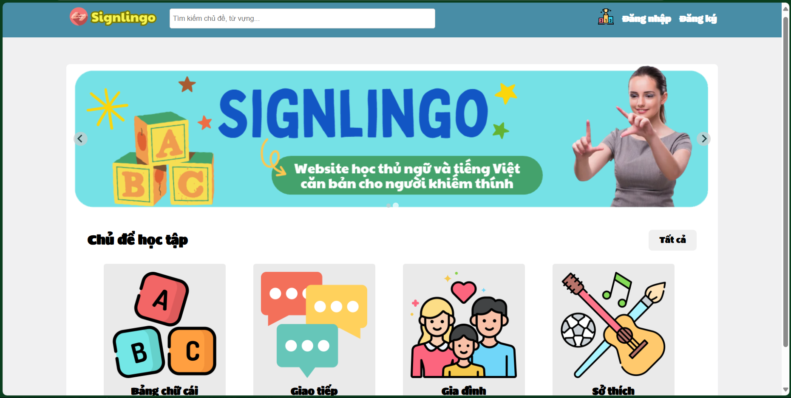
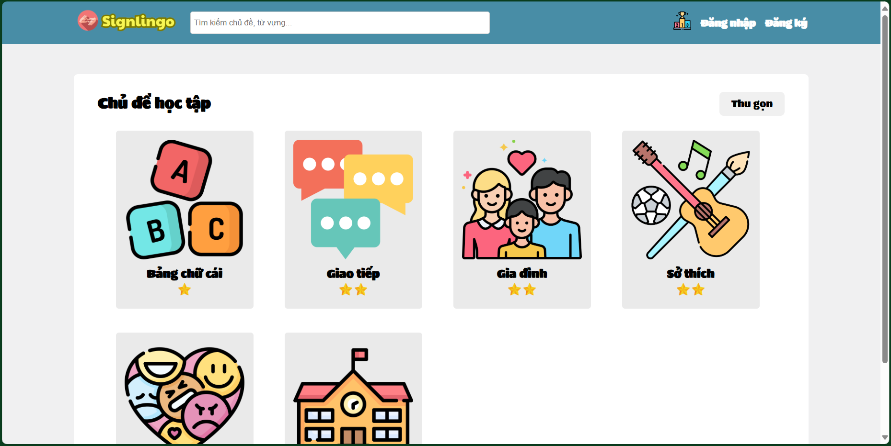
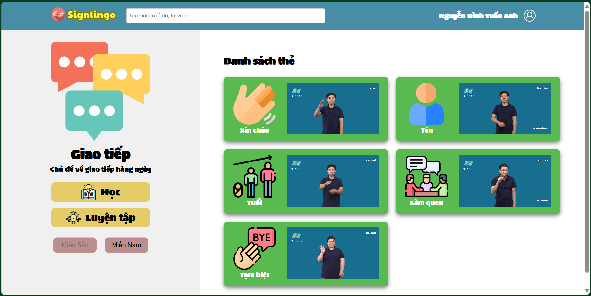
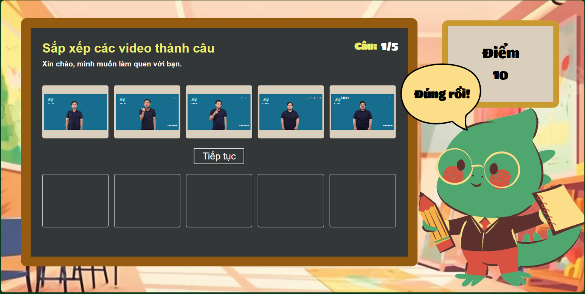

# Signlingo - Website Học và Luyện Tập Ngôn Ngữ Ký Hiệu (LMS)
Dự án hỗ trợ học ngôn ngữ ký hiệu dành cho người khuyết tật nghe nói, cung cấp các tính năng học tập tương tác như flashcard học tập, bài tập thực hành và luyện tập sử dụng model nhận dạng thủ ngữ.

## 📖 Mô Tả Dự Án:
Lấy cảm hứng từ **Duolingo**, đây là trang web hỗ trợ học ngôn ngữ bằng cách cung cấp trải nghiệm trực quan qua hình ảnh và video.
- Đa dạng bài giảng, bài tập và các trò chơi giúp học tập và ôn luyện ngôn ngữ ký hiệu.
- Luyện tập ngôn ngữ ký hiệu theo chủ đề phong phú với nhiều cấp độ hấp dẫn khác nhau.
- Giao diện thiết kế bắt mắt, sinh động, thao tác đơn giản phù hợp với đối tượng người dùng bình thường và khuyết tật nghe nói ở nhiều độ tuổi.

### Video Demo 📽️: https://youtu.be/b72B-Ina-yM

## 🛠️ Công Nghệ Sử Dụng 
### Frontend:
- **SvelteKit**: Framework hiện đại giúp phát triển giao diện nhanh và hiệu quả.
- **SCSS**: Hỗ trợ viết CSS dễ bảo trì và mở rộng.
- **Axios**: Giao tiếp API giữa frontend và backend.
### Backend:
- **Django**: Framework mạnh mẽ để phát triển backend và xây dựng API.
- **Django REST Framework (DRF)**: Tạo API nhanh chóng và linh hoạt.
- **Cơ Sở Dữ Liệu**:
  - SQLite (phát triển): Cơ sở dữ liệu nhẹ cho môi trường phát triển.
  - PostgreSQL (sản phẩm): Cơ sở dữ liệu mạnh mẽ cho triển khai thực tế.

## 🚀 Cài Đặt Dự Án
### Frontend
- Chuyển đến thư mục:  
`cd front-end`  
- Cài đặt các thư viện cần thiết:  
`npm install`  
- Chạy server:  
`npm run dev`  
- Truy cập frontend tại cổng 5173

### Backend (dữ liệu bài học)
- Chuyển đến thư mục:  
`cd data-back-end`  
- Tạo và kích hoạt môi trường ảo:  
`python -m venv venv`  
`source venv/bin/activate` (Linux/Mac) hoặc `venv\Scripts\activate` (Windows)  
- Cài đặt các thư viện cần thiết:  
`pip install -r requirements.txt`  
- Chạy server:  
`python manage.py runserver`  
- Truy cập tại cổng 8000

### Backend (nhận dạng thủ ngữ)
- Chuyển đến thư mục:  
`cd videototext-back-end`  
- Tạo và kích hoạt môi trường ảo:  
`python -m venv venv`  
`source venv/bin/activate` (Linux/Mac) hoặc `venv\Scripts\activate` (Windows)  
- Cài đặt các thư viện cần thiết:  
`pip install -r requirements.txt`  
- Chạy server:  
`uvicorn main:app --port 8001`  
- Truy cập tại cổng 8001

## 📸 Hình Ảnh Minh Họa
### Màn hình chính(trang chủ):

### Màn hình các chủ đề học tập:

### Màn hình các thẻ học tập theo chủ đề:

### Màn hình luyện tập sắp xếp câu: 

